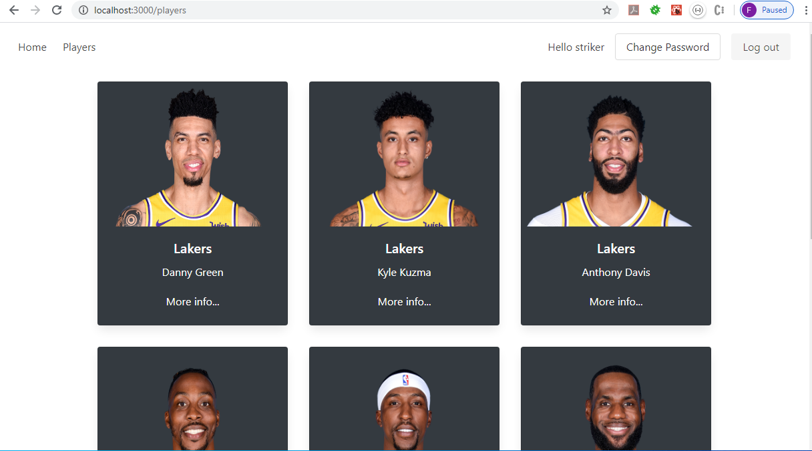

# AWS Assignment 2

The Project was built on AWS services and React front end. For images being stored in the cloud, a Amazon S3 bucket was used. The S3 bucket provides an object's URL for each element in the bucket. This URL is stored in a DynamoDB, with all the information required. I defined 2 Lambda Functions, one for Scan and second for getting an specific element. Finally, the APIGateway was created to manage the API which is used by the React front end.

The React front end manages register, email verification, and log in authentication through cognito an Amazon service. In addition, the app connects to the API that is connected to the Lambda functions. The Lambda functions are connected to the data stored on the DynamoDB which contains the URLs in the S3 bucket as well.

## ReactApp views





## 1. Dynamo Database


## 2. S3 Bucket


## 3. Lambda functions:

```
const AWS = require("aws-sdk")
const docClient =  new AWS.DynamoDB.DocumentClient({ region: "us-east-1" })

exports.handler = async event => {
    var params = {
        TableName: "Items"
    }

try {
    // Utilising the scan method to get all items in the table
    const data = await docClient.scan(params).promise();
    const response = {
      statusCode: 200,
      body: JSON.stringify(data.Items)
    };
    return response;
  } catch (e) {
    return {
      statusCode: 500
    };
  }
};
```

```
const AWS = require("aws-sdk");
const docClient =  new AWS.DynamoDB.DocumentClient({ region: "us-east-1" });

exports.handler = async event => {

    var player= {};

    player.Id = event.params.path.id;

    var params = {
        TableName: "Items",
        Key: {
            Id: parseInt(player.Id)
        }
    };

try {
    // Utilising the scan method to get all items in the table
    const data = await docClient.get(params).promise();
    const response = {
      statusCode: 200,
      body: data.Item
    };
    return response;
  } catch (e) {
    return {
      statusCode: 500, body: e
    };
  }
};
```
## 4. API Gateway


